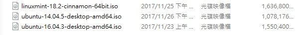
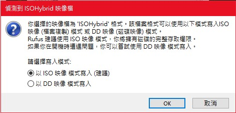
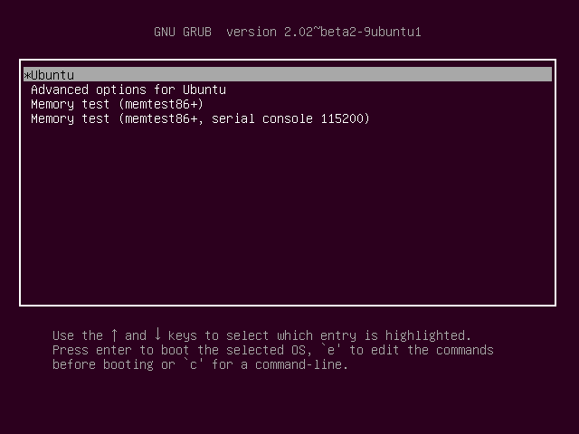

環境建置
==========
此章節講述如何在電腦安裝Linux ubuntu系統，以及Robot Operating System(ROS).
 

選擇ubuntu映像檔下載
--------------------
在網路上搜尋ubuntu可能會跳出許多衍生版,像是 ubuntu-mate , ubuntu-gnome, 或者 Linux Mint,雖然這些版本的kernel都相同,在系統上的參數會有些許不同,再之後使用ROS時可能會遇到因版本不同，在安裝設定上會需要修改,所以對於初學者建議下載下面提供的版本。

 * `Linux-ubuntu <http://ftp.tku.edu.tw/Linux/Ubuntu/ubuntu-releases/16.04/ubuntu-16.04.5-desktop-amd64.iso>`_

燒錄usb開機碟
---------------------
如果映像檔下載完成後,首先點選 `Rufus`_ 連結下載此軟體並準備一顆大於映像檔大小的隨身碟,然後開啟軟體後會看到以下畫面,依照軟體畫面從上而下,首先裝置只要有USB連接都會顯示出來,資料分割方式,系統及單元大小則按照圖中的設定就可。

.. figure:: image/usb_0.jpg

再來則是點選圖中紅框的光碟機，請選擇前面下載好的映像檔後，然後執行

如果跳出以下這張圖,請選擇ISO,然後ok繼續。

.. _Rufus: https://rufus.ie/en_IE.html

安裝ubuntu
---------------
按照前面燒錄好隨身碟後,請重開機進入BIOS,選擇隨身碟開機之後會看到類似以下選單圖

選擇'開啟不安裝'進入

`安裝ubuntu`_ 簡易的流程如連結的步驟雷同,按照流程安裝即可

.. warning::
	需要注意的事,假設使用者的電腦本身就已經有了windows系統且要保留windows系統,那麼在選擇安裝類型時,一定要選擇保留原系統的選項,否則選錯,資料會全部被格式化

.. _安裝ubuntu: https://blog.xuite.net/yh96301/blog/242333268-%E5%AE%89%E8%A3%9DUbuntu+16.04

更新ubuntu及安裝ROS
-------------------------
安裝好後，先更新ubuntu和安裝c/c++編譯器::

	$ sudo apt-get update && sudo apt-get upgrade
	$ sudo apt-get install build-essential

之後透過 'VSCode_' 下載deb安裝包,下載後點選安裝開啟程式,點選左下角齒輪,開啟延伸模組在搜尋欄搜尋ROS,安裝圖下圖的模組

.. figure:: image/vscode_extention.png

.. _VSCode: https://code.visualstudio.com/

安裝ROS請進入此 'Ros-wiki_' ,因為這裡所安裝的ubuntu版本為ubuntu xenial(16.04),對應到ROS的版本為Kinetic,所以請點選Kinetic進入安裝教程,下面大概列出會用到的指令::

	$ sudo sh -c 'echo "deb http://packages.ros.org/ros/ubuntu $(lsb_release -sc) main" > /etc/apt/sources.list.d/ros-latest.list'
	$ sudo apt-key adv --keyserver hkp://ha.pool.sks-keyservers.net:80 --recv-key 421C365BD9FF1F717815A3895523BAEEB01FA116
	$	sudo apt-get update
	$ sudo apt-get install ros-kinetic-desktop-full
	$ sudo rosdep init
	$ rosdep update

.. _Ros-wiki: http://wiki.ros.org/
	
.. note::
	至於依照網站1.6部份,指令如下,在做加入環境變數的步驟,如果有做此步驟就不用,每次開新的終端機(terminal)就要在呼叫一次::
	
	$ echo "source /opt/ros/kinetic/setup.bash" >> ~/.bashrc

	

